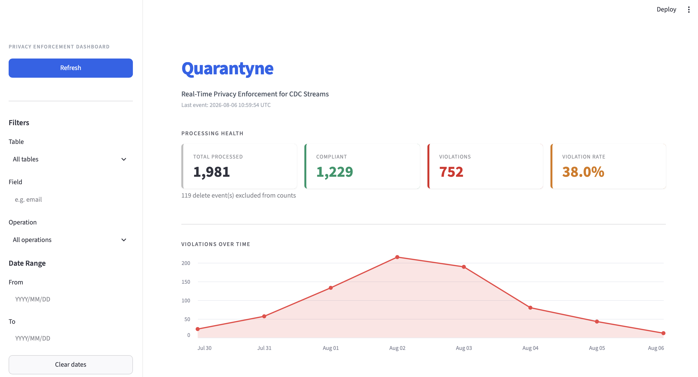
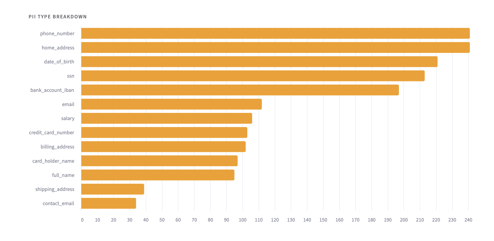
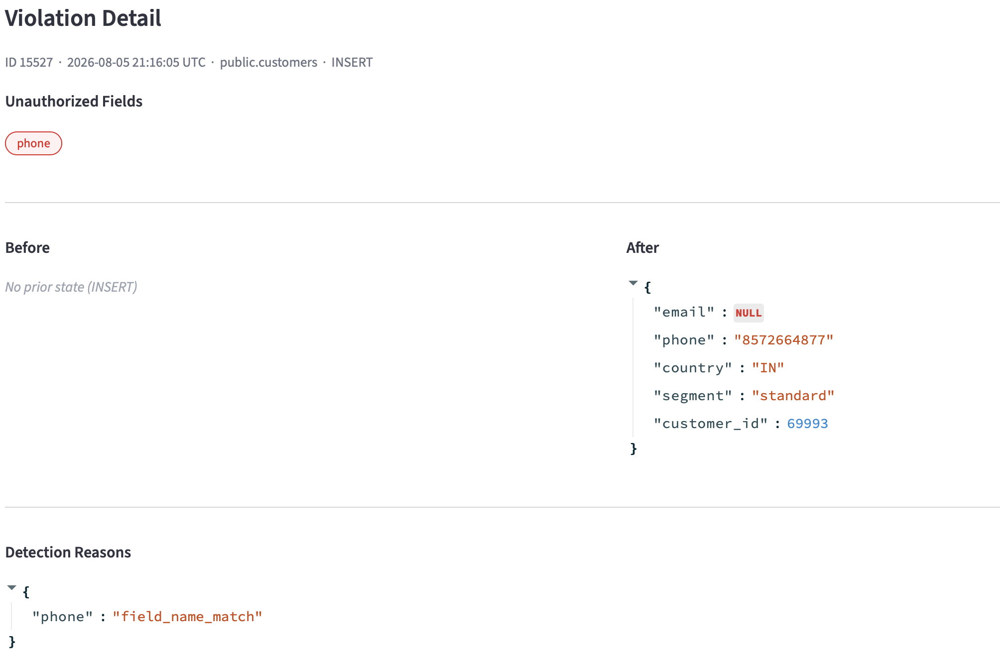
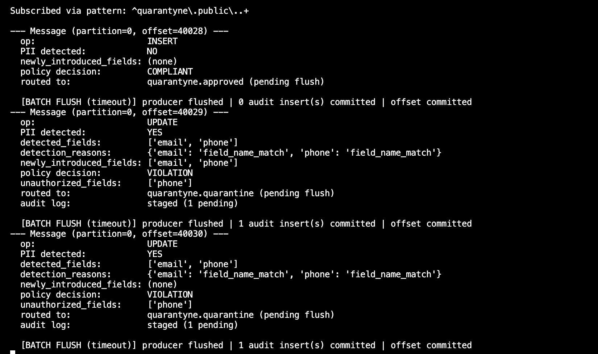
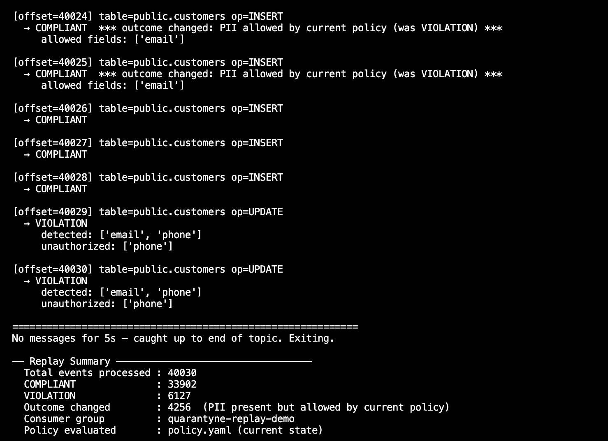

# QUARANTYNE
### Real-Time Privacy Enforcement for CDC Streams

Quarantyne is a real-time privacy enforcement gateway that sits between a database's change stream and its downstream consumers. It detects sensitive data (PII) the moment it appears in a row-level change, before that change reaches any system not authorized to see it, and quarantines the violation with a full audit trail.

---

## Screenshots

**Processing health, violation trend, and active filters**


**PII type breakdown — ranked by violation frequency across all tables**


**Violation detail — before/after diff, detection reasoning, newly introduced fields (PII masked for display)**


**Consumer — live enforcement: clean INSERT routed to approved, UPDATE with unauthorized PII quarantined**


**Replay demo — historical events reprocessed through updated policy, outcome changes surfaced**


---

## The Problem

Most PII protection happens after the fact: column-level masking, access control on known sensitive fields, DLP tools scanning data at rest. All of that assumes the PII has already been classified and a rule already exists for it.

The gap Quarantyne addresses is different: **what happens when a sensitive field shows up somewhere nobody decided it should be?** A developer adds an `email` column to a table for an unrelated feature. A refactor accidentally stops excluding a field from a CDC pipeline. A debugging change logs a full object instead of a sanitized one. None of these trigger existing masking rules, because the field wasn't classified as sensitive in the first place — it just appeared.

Quarantyne catches that moment: a field going from absent (or empty) to populated, evaluated against a per-table policy, before the event reaches any downstream consumer.

---

## Architecture

```
PostgreSQL (customers, employees, orders, payments, ...)
        │
        ▼
    Debezium (CDC via WAL — pgoutput plugin)
        │
        ▼
Kafka — quarantyne.public.* (one topic per table, raw/intake)
        │
        ▼
  Consumer: PII Detector + Policy Engine
  (policy.yaml hot-reloaded on change, no restart required)
        │
   ┌────┴────┐
   ▼         ▼
COMPLIANT  VIOLATION
   │         │
   ▼         ▼
quarantyne  quarantyne.quarantine
.approved   + Postgres audit log
   │         (violation_audit_log)
   ▼
Downstream
consumers
        │
        ▼
Streamlit Dashboard
(reads from Postgres, read-only)
```

**Why the topics are gated this way:** downstream consumers only ever read from `quarantyne.approved`, never the raw intake topic. This is a deliberate correction from an earlier design where consumers read the raw topic in parallel with the validator — that design doesn't actually prevent propagation, since a downstream consumer could read an event before the validator finishes evaluating it. Gating through an approved topic is what makes this a genuine enforcement boundary rather than a monitoring layer.

---

## Why Kafka (not batch, not Kinesis, not Spark Structured Streaming)

**Why not batch scanning?** A batch job scanning tables periodically means sensitive events may already have propagated to every downstream consumer before the next scan runs. At even a modest event rate, a 5-minute detection window can mean millions of events processed before a violation is caught. The requirement isn't "find PII eventually" — it's "evaluate every change before it crosses the approved boundary."

**Why Kafka specifically, not just "a queue"?** The event source is Debezium reading Postgres's write-ahead log — that's inherently a continuous stream by construction, not something chosen to be treated as one. On top of that structural fact, Kafka's specific properties matter here: replay (reprocess historical events through an improved detector without re-touching the source database), consumer groups (independent downstream consumers can read the approved stream without coordinating with each other), and durable retention (a detector bug fix doesn't mean lost data, it means a replay).

**Why not Kinesis, given the AWS background?** Kinesis would be a reasonable choice in a fully AWS-native shop optimizing for minimal operational overhead. Kafka wins here specifically because of the replay model and the assumption that a real deployment of this system might span producers across multiple environments, not just AWS.

**Why not Spark Structured Streaming for the consumer?** At this event volume, Spark is not justified — it would add operational complexity (cluster management, checkpointing infrastructure) with no corresponding benefit. A lightweight Python consumer is sufficient and correctly scoped. This is a deliberate judgment call, not an oversight: knowing when *not* to reach for a heavier tool is as much a signal of experience as knowing when to use one.

---

## Detection Design

**Two-signal approach, not a single mechanism:**

1. **Primary — scan `after` directly.** Field-name matching (e.g. a field literally called `email`, `phone`, `ssn`) plus regex pattern matching on values, for every event type (insert, update, delete). This is the mechanism that guarantees coverage, since it doesn't depend on a prior state existing.
2. **Secondary — before/after diff.** On updates, compares `before` and `after` to flag *newly introduced* fields specifically — a field appearing for the first time is a stronger signal than one that already existed and was presumably already reviewed. This only applies to updates; inserts have no `before` to diff against.

**Why regex/field-name matching instead of ML/NER (e.g. Presidio)?** Explainability and latency, in that order. In a compliance-adjacent inline path, a black-box ML classifier is itself a governance risk — you can't easily explain *why* it flagged (or missed) something. A deterministic, auditable v1 was prioritized over classification sophistication. This is an explicit scope decision, not a limitation nobody considered.

**Why field-name context is required for phone/credit-card/SSN patterns, but not email:** email's regex is specific enough on its own that field-name-blind matching rarely misfires. Phone and credit-card patterns are just digit-count checks — a 10-digit `order_id` or a 13-digit `transaction_amount` will match a "phone" or "credit card" pattern with zero relation to actual PII. Requiring the field name to also be plausible (e.g. contains `phone`, `mobile`, `card`, `ssn`) eliminates that false-positive class.

---

## Measured Detection Accuracy

Tested against a 20-case hand-labeled set (not the live pipeline — a standalone, repeatable test):

| Metric | Pattern-matching alone | Pattern + field-name context (final) |
|---|---|---|
| Precision | 80% | **100%** |
| Recall | 100% | **91.67%** |
| Accuracy | 85% | **95%** |

**The tradeoff, explicitly:** field-name-blind pattern matching caught everything (100% recall) but also flagged legitimate business identifiers as PII (order IDs, transaction amounts — 80% precision). Requiring field-name plausibility eliminated those false positives entirely, at the cost of one false negative: an SSN mentioned inside a generically-named field (e.g. `notes`) with no PII-suggestive field name is not caught by pattern matching that requires field-name context.

**Why precision was prioritized over recall for this system:** this is a policy-enforcement gateway, not a passive scanner. A false positive here means blocking legitimate data from reaching downstream consumers — a real operational cost. That cost argued for tightening precision even at some recall expense. The known gap (PII in free-text/generically-named fields) is a documented limitation, not a hidden one — closing it fully would require NER-based detection, which was deliberately excluded from v1 for the explainability/latency reasons above.

---

## Failure Handling

**At-least-once delivery, explicit offset management.** `enable.auto.commit` is disabled. Kafka offsets are only committed after a message's full processing sequence — produce to approved/quarantine topic, flush, Postgres audit write, commit — completes successfully. If any step fails, the offset is not committed and the message is redelivered on restart.

**Proven via deliberate crash injection**, not just designed: the consumer was killed mid-processing (before the commit step) using a controlled test harness, and confirmed to correctly redeliver the interrupted message on restart, with zero data loss and no silent skips.

**Policy hot-reload without restart.** The consumer watches `policy.yaml` for file-modification changes on every poll tick. When the file changes, the new policy is loaded and validated before replacing the in-memory config — if the reload fails, the previous policy stays active and a warning is logged. This means per-table allowlists can be updated in production with zero downtime and zero message loss.

**Batching, added after profiling revealed a real bottleneck.** The original per-message `producer.flush()` + synchronous Postgres commit created a real cost: average latency 0.4ms, but spikes up to 20.7ms attributable to individual DB round-trips on every violation. Batching (flush every 100 messages, commit every 50 violations, with a 5-second idle-timeout fallback to avoid indefinite pending state during low traffic) reduced average latency to sub-millisecond with a max of 0.3ms.

**The batching tradeoff, stated plainly:** batching trades offset-commit granularity for throughput — a crash mid-batch now means redelivering up to ~100 messages instead of 1, versus the unbatched version. This is safe under at-least-once semantics (reprocessing a compliant message or re-writing an audit row is harmless, not corrupting), but it's a real, deliberate tradeoff, not a free improvement.

**A genuine bug found and fixed during this process, worth documenting honestly:** the initial time-based flush trigger only evaluated inside the "message received" branch of the poll loop — if the consumer caught up and had nothing new to process, the check never ran, and a pending batch could sit unflushed indefinitely. Fixed by moving the time check to run unconditionally on every loop iteration, including idle polls. Verified via a targeted test: a single message left pending with no further traffic correctly triggered an automatic `[BATCH FLUSH (timeout)]` within the 5-second window.

---

## Load Testing

Two runs, same architecture, before and after the batching fix:

| | Unbatched | Batched |
|---|---|---|
| Volume tested | 500 / 10,000 messages | 10,000 messages |
| Throughput | 1,412 – 2,221 msg/s | 2,336.9 msg/s |
| Avg latency | 0.4ms | ~0ms |
| Max latency | 20.7ms | 0.3ms |

**What this proves:** correctness and consistency under a real burst — zero errors, zero misrouted messages, correct behavior at 20x the initial test volume, with throughput *improving* rather than degrading at higher volume.

**What this does not prove, stated honestly rather than implied:** sustained load over minutes/hours, multi-partition or multi-consumer horizontal scaling, or behavior under backpressure where producers outpace the consumer. The current architecture processes one partition with a single consumer instance — a real next step, not built here, would be partitioning the topic and scaling consumer instances horizontally within the same consumer group.

---

## Tech Stack

| Component | Choice |
|---|---|
| CDC source | PostgreSQL (`REPLICA IDENTITY FULL` for complete before/after row capture) |
| Change capture | Debezium (Postgres connector, `pgoutput` plugin) |
| Event backbone | Apache Kafka |
| Consumer | Python (`confluent-kafka`) |
| Detection | Regex + field-name heuristics (no ML/NER in v1, by design) |
| Policy | YAML-configured, per-table allow-lists |
| Audit storage | PostgreSQL (separate from the source table) |
| Dashboard | Streamlit |
| Infra | Docker Compose (local dev) |

**Deliberately excluded from v1:** Schema Registry (no multi-team schema evolution problem to justify it here), Spark Structured Streaming (unjustified for this event volume), Kubernetes (proving an architecture, not running a production cluster), ML-based detection (explainability/latency tradeoff, see above).

---

## Dashboard

The Streamlit dashboard reads from Postgres (read-only) and provides real-time observability over the enforcement pipeline.

**Processing Health** — four metric cards: Total Processed, Compliant, Violations, Violation Rate. Delete events are tracked separately and excluded from the rate calculation.

**Violations Over Time** — daily aggregation chart showing the violation trend. Useful for spotting incident spikes (a sudden rise followed by resolution is visible as a bell curve in the demo data).

**PII Type Breakdown** — horizontal bar chart ranked by violation frequency across all tables. Shows which PII types (SSN, phone, home address, etc.) are most commonly appearing in unauthorized positions.

**Policy Violations table** — paginated (50 rows/page) with full filter support:
- **Table** — filter by source table
- **Field** — search by unauthorized field name (uses a Postgres GIN index on the JSONB `unauthorized_fields` column)
- **Operation** — filter by INSERT / UPDATE / DELETE
- **Date range** — filter violations by event timestamp; applied to both the table and the charts simultaneously

**Violation detail modal** — click any row to open a full before/after diff with: unauthorized fields highlighted, detection reasons (field_name_match vs pattern_match), newly introduced fields flagged, and all PII values masked for safe display in the UI.

---

## Known Limitations (documented, not hidden)

- PII in unstructured/free-text fields with generic names will not be caught (91.67% recall gap, explained above)
- Tested at 500–10,000 message bursts, not sustained load over extended periods
- Single partition, single consumer instance — no horizontal scaling tested
- No backpressure testing (producer significantly outpacing consumer)
- Field-name heuristics are static (a hardcoded hint list) rather than adaptive to schema drift not anticipated in advance

**What I'd add for a real production deployment:** NER-based secondary detection for free-text fields (accepting the latency/explainability cost as a conscious tradeoff), multi-partition + multi-consumer horizontal scaling, sustained-duration load testing, continuous schema-drift monitoring rather than a static field-name list, and a human-review queue for borderline/low-confidence cases instead of a binary allow/quarantine decision.

---

## v2 Roadmap

Features deliberately scoped out of v1 but clearly defined for a next iteration:

| Feature | Rationale |
|---|---|
| NER-based detection (e.g. Presidio) | Close the free-text recall gap; add as a secondary signal alongside the current deterministic detector |
| Multi-partition + multi-consumer scaling | Partition the intake topics by table; run one consumer group instance per partition for horizontal throughput |
| Schema Registry integration | Detect schema drift automatically — new fields added to a table surface as alerts before they appear in the stream |
| Human review queue | Replace the binary COMPLIANT/VIOLATION decision with a third state (REVIEW) for low-confidence or borderline cases |
| Alert / notification layer | Trigger PagerDuty / Slack when violation rate exceeds a threshold or a spike is detected in the trend chart |
| AWS-native deployment | Replace Docker Compose with MSK (Kafka), RDS (Postgres), and ECS/EKS for the consumer; Debezium on ECS or MSK Connect |
| REST API | Expose violation data and policy management via a typed API so external systems can query the audit log programmatically |

---

## Local Development Credentials

The Postgres credentials used throughout this project (`privacypulse` / `privacypulse`) are throwaway local development credentials defined in `docker-compose.yml` and loaded via environment variables (`.env`). They are not representative of how secrets should be handled in a real deployment.

A production deployment would source credentials from environment variables or a secrets manager (e.g. AWS Secrets Manager, HashiCorp Vault), with no credentials appearing in source code or config files checked into version control.

---

## Setup

```bash
# 1. Start infrastructure
docker compose up -d

# 2. Create source tables and set replica identity (via psql or TablePlus)
#    schema_customers.sql, schema_orders.sql
#    Then: ALTER TABLE customers REPLICA IDENTITY FULL;
#          ALTER TABLE orders REPLICA IDENTITY FULL;

# 3. Create audit tables
#    schema_audit.sql          — violation_audit_log
#    schema_processing_log.sql — processing_log
#    add_indexes.sql           — GIN + btree indexes for dashboard query performance

# 4. Register the Debezium connector (via Kafka UI at localhost:8080 or REST)
#    See debezium-connector-config.json

# 5. Set up the Python environment
python3 -m venv .venv
source .venv/bin/activate
pip install -r requirements.txt

# 6. Copy and configure environment variables
cp .env.example .env
# Edit .env with your Postgres credentials

# 7. Run the consumer (enforces policy in real time)
python3 consumer.py

# 8. Run the dashboard (separate terminal, same venv activated)
streamlit run dashboard.py
```

**To seed realistic demo data** (2,100 events across 4 tables with a bell-curve violation spike):
```bash
python3 seed_demo.py
```

---

## Demo Scenario

**Live enforcement:**
1. Insert a clean row into `customers` (no PII) → observe `COMPLIANT`, routed to `quarantyne.approved`
2. Update that row to add a `phone` value → observe `VIOLATION`, routed to `quarantyne.quarantine`, logged to `violation_audit_log`
3. Open the dashboard → see the violation reflected in real time; click the row for the full detail modal (before/after diff, detection reasoning, newly-introduced-field flag, PII masked)

**Policy hot-reload:**
4. Edit `policy.yaml` to add `phone` to `allowed_pii_fields` for `public.customers`
5. The consumer prints `Policy config reloaded` within one poll tick — no restart
6. Repeat step 2 → now routes to `quarantyne.approved` (phone now permitted)

**Policy replay:**
7. Run `python3 replay_demo.py` — reprocesses the full Kafka topic from offset 0 through the current policy
8. Any events that would have different outcomes under the new policy are flagged as `outcome changed`
